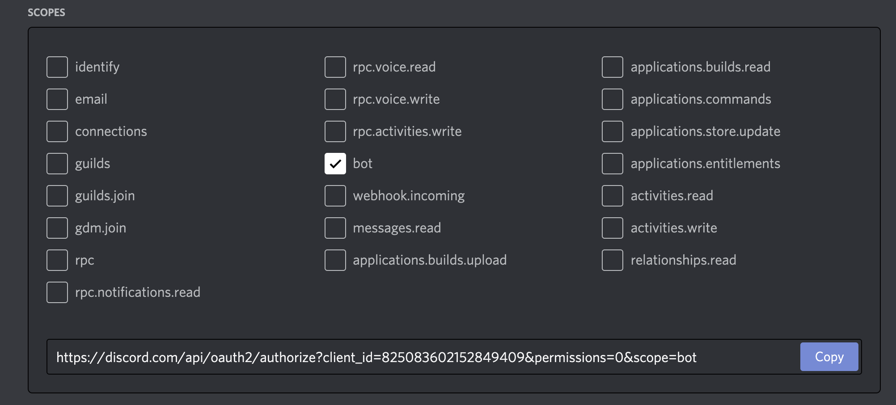

# CryptOrchids Watering Can

This project includes a [Hardhat](https://hardhat.org/) script that allows the owner of a CryptOrchid to water their plant by calling the `water` function on the CryptOrchidsERC721 smart contract on the Ethereum blockchain.

The script is designed to be defensive and aims to only water your plant when your plant needs to be watered. **Given the asynchronous nature of writing to the Ethereum block chain, if you run this script multiple times in quick succession, it may kill your CryptOrchids.** You should always ensure you understand the code that you are running, and we make no guarantees about the quality or appropriateness of this software. See DISCLAIMER for more.

You can also water your CryptOrchid from the CryptOrchid website, but the CryptOrchids website is not guaranteed to exist forever. Visit https://cryptorchids.io/greenhouse to water your CryptOrchids - you'll need to use a web3 enabled browser, such as a desktop browser with MetaMask installed, or the MetaMask mobile browser.

## Prerequisites

You will need to own a CryptOrchid before using this script. CryptOrchids can be purchased on the CryptOrchids website at https://cryptorchids.io

You will also need an Infura account and API key which you can get for free on the Infura website: https://infura.io/

If you want to use the script's Discord messaging functionality, you will need a Discord Application and Bot from the Discord developer site, and a Discord server the bot can access. See Discord Setup below.

This script can easily be deployed to Heroku and run on a job schedule, so you'll need a free Heroku account from https://heroku.com. The script can be run locally or from any server that offers a NodeJS runtime.

Finally, you may also want to create a new wallet to hold your CryptOrchids in. This script will require you to set your private key as an ENV variable to authenticate. Storing these secrets on Heroku is probably fine, but to reduce risk of leaking the secrets to your primary wallet, use a CryptOrchids specific wallet.

## Discord Setup

This script includes some functionality to send a private message from a Discord bot to yourself to notify you about transactions resulting from calling the `water` function. This allows you to follow the transaction and ensure it completes before the watering window closes.

First, you need a Discord server where you have permission to add a Bot. It's free and easy to create your own Discord server.

Once you have a server you can use, grab the server ID following the instructions at this Discord support article. You'll enable developer mode, which will also allow you to get your user ID which you will also need - https://support.discord.com/hc/en-us/articles/206346498-Where-can-I-find-my-User-Server-Message-ID-.

Next, create a New Application on the Discord developer portal by clicking the button in the top right corner at https://discord.com/developers/applications.

Give your application a name (this is only for you, so it doesn't matter too much).

Click into the Bot menu item. You can name your bot and give it an avatar, but the only requirement is that you copy the Bot token:


Click into the OAuth2 menu item. Give your application the bot scope:



Then, in the next section, give your bot the Send Messages permission under Text Permissions:


Now you're ready to authenticate your bot to your server - copy the OAuth URL from the scopes box and open it in your browser. You'll be asked to give permission to the bot to enter your server.

Once the bot is in your server, ensure you have the following three values and you are ready to deploy or run your script:

- **botToken** i.e `SBI1MDI0NzUyNDQ3NzgyOTEz.YF36LQ.Sw-rczOfalK0lVzuW8vBjjcnsy0`
- **serverId** i.e. `814900494928445450`
- **userId** i.e. `694927656805859499`

## Run locally

You can run this script locally by pulling the repo to your local machine.

First, install the dependencies with `npm` or `yarn`.

Then copy the `.env.example` file to `.env` and replace the example values with your own.

You can check that things are set up properly by running the `testSetup.ts` script:
```
$ yarn ts-node ./testSetup.ts
// or
$ ts-node ./testSetup.ts
```

If you're using the Discord functionality, you should receive a private message from your bot. Otherwise the message will be printed to the terminal.

If the script runs scucessfully with the expected address, then you're ready to use the watering can. To run the watering script, use `ts-node` to run the `waterPlants.ts` script:

```
$ yarn ts-node ./waterplants.ts
// or
$ ts-node ./waterPlants.ts
```

## Deploy to Heroku

The easiest way to run this script on a chron scheduler is to deploy it to Heroku with this button:

[](https://heroku.com/deploy)

Heroku will require that you input the ENV vars that are necessary to run the script, and will run the `testSetup.ts` script after a successful deploy, so if you're using the Discord functionality you should receive a message.

The `scheduler` add-on is included in the `app.json` but **you still must schedule the script to run** and we recommend running it hourly on the `:10` minute. This way the script will run every hour 10 minutes after the hour, which will allow the script to easily determine which CryptOrchids need watering, while allowing the Ethereum blockchain 50 minutes to complete watering.

To set up the `waterPlants.ts` script to run, once your Heroku app finishes deploying, click "Manage App", and then navigate to the Heroku Scheduler addon. Create a new job, run it every hour on the `:10`, and enter 

```bash
yarn ts-node waterPlants.ts
```

as the Run Command.

Your form should look like this:


With that you're all set! If you chose to use the Discord bot functionality, you'll receive messages when the Watering Can performs the `water` method with a link to the transaction on Etherscan.

## Halp!!

If you're a bit lost reading through this then please stop and come get some help from the CryptOrchids team. We'd hate to see you kill your CryptOrchid, and using this project requires a bit of engineering know-how.  We're more than happy to help you get your Watering Can set up - join is in our Discord: https://discord.gg/ADFS4JAdTa

## Disclaimer

_THIS SOFTWARE IS PROVIDED BY THE COPYRIGHT HOLDERS AND CONTRIBUTORS “AS IS” AND ANY EXPRESS OR IMPLIED WARRANTIES, INCLUDING, BUT NOT LIMITED TO, THE IMPLIED WARRANTIES OF MERCHANTABILITY AND FITNESS FOR A PARTICULAR PURPOSE ARE DISCLAIMED. IN NO EVENT SHALL THE COPYRIGHT OWNER OR CONTRIBUTORS BE LIABLE FOR ANY DIRECT, INDIRECT, INCIDENTAL, SPECIAL, EXEMPLARY, OR CONSEQUENTIAL DAMAGES (INCLUDING, BUT NOT LIMITED TO, PROCUREMENT OF SUBSTITUTE GOODS OR SERVICES; LOSS OF USE, DATA, OR PROFITS; OR BUSINESS INTERRUPTION) HOWEVER CAUSED AND ON ANY THEORY OF LIABILITY, WHETHER IN CONTRACT, STRICT LIABILITY, OR TORT (INCLUDING NEGLIGENCE OR OTHERWISE) ARISING IN ANY WAY OUT OF THE USE OF THIS SOFTWARE, EVEN IF ADVISED OF THE POSSIBILITY OF SUCH DAMAGE._